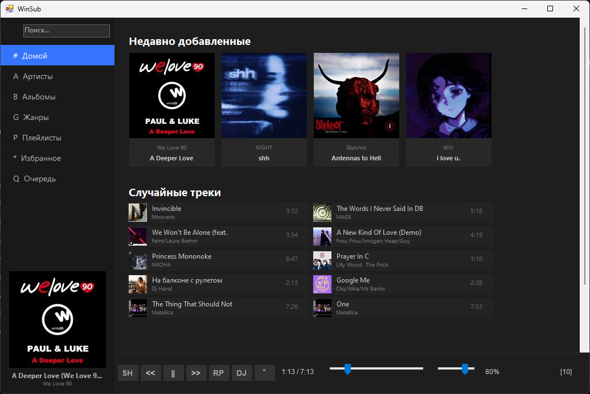
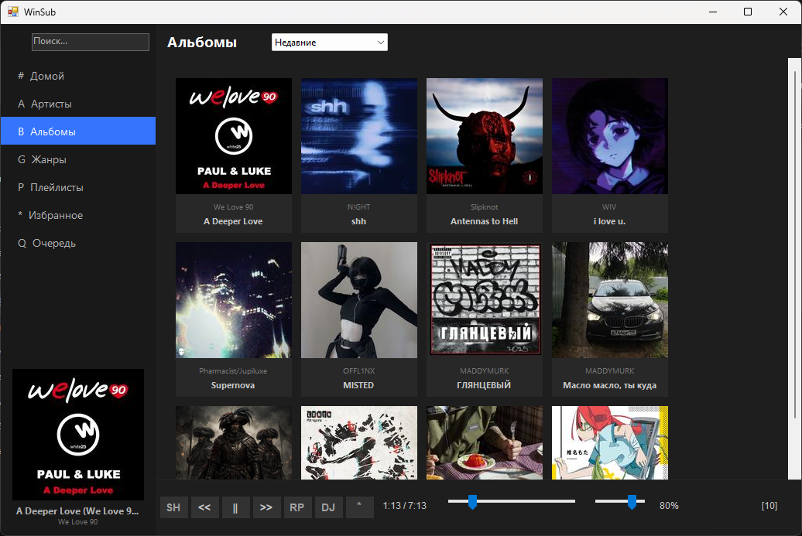
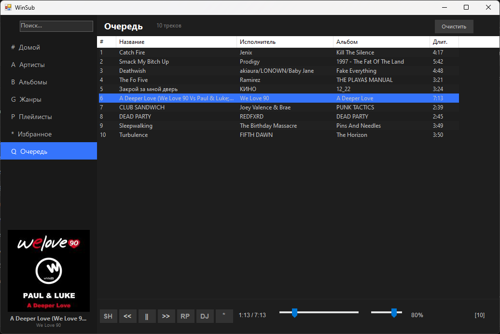
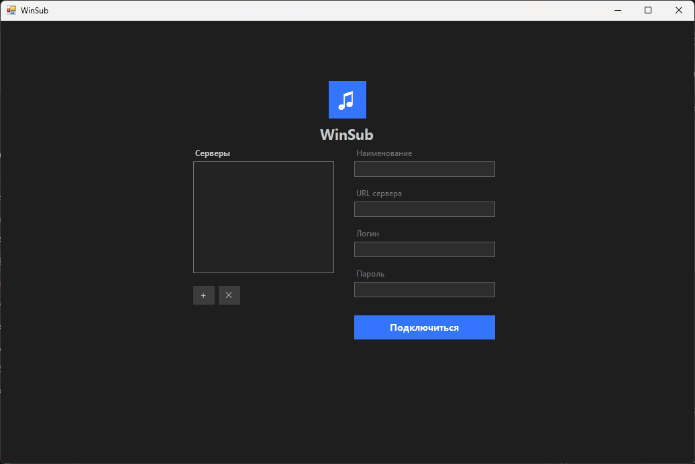

# WinSub

# Русский

Subsonic/Navidrome плеер для Windows XP–Win7 (32-bit). Полный вайбкод, могут быть грубые ошибки.

## Возможности
- Поддержка нескольких серверов (Настройки сохраняются по пути "%AppData%\WinSub\")
- Боковое меню (Артисты, Жанры, Плейлисты, Избранное, Очередь)
- Поиск по трекам, артистам, альбомам
- Автодобавление треков в конец очереди
- Управление очередью с помощью перетаскивания треков
- Добавление/удаление треков из избранного
- Поддержка FFmpeg для прямого стриминга FLAC на устройство
- Поддержка медиа-клавиш клавиатуры и Bluetooth-устройств
- Горячие клавиши (Пробел, стрелки, Ctrl+F, F11)
- Кэширование обложек

## Требования
- .NET Framework 4.0
- Windows XP SP3 – Windows 7 (32-bit)
- FFmpeg (только для FLAC проигрывания)

## Сборка
Используйте `WinSub.sln` в Visual Studio 2019 для сборки.

## Скриншоты

## Лицензия
MIT

---

# English

Subsonic/Navidrome desktop player for Windows XP–Win7 (32-bit). Full vibecode, may contain rough bugs.

## Features
- Multi-server support (settings saved at "%AppData%\WinSub\")
- Sidebar navigation (Artists, Genres, Playlists, Favorites, Queue)
- Search across tracks, artists, albums
- Auto-add tracks to the end of the queue
- Queue management with drag & drop
- Add/remove tracks from favorites
- FFmpeg support for direct FLAC streaming to device
- Media key support for keyboard and Bluetooth devices
- Keyboard shortcuts (Space, arrows, Ctrl+F, F11)
- Cover art caching

## Requirements
- .NET Framework 4.0
- Windows XP SP3 – Windows 7 (32-bit)
- FFmpeg (for FLAC playback only)

## Build
Use `WinSub.sln` in Visual Studio 2019 for build.

## Screenshots

## License
MIT